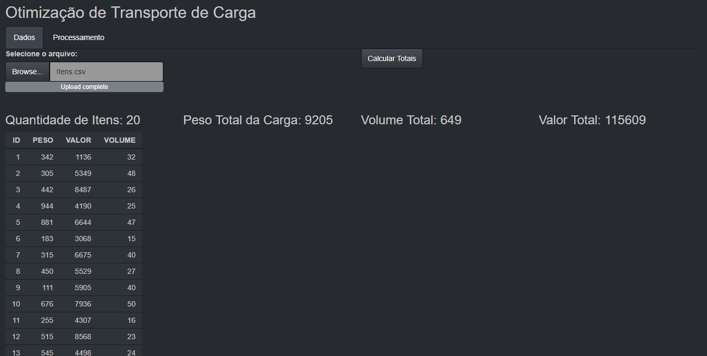
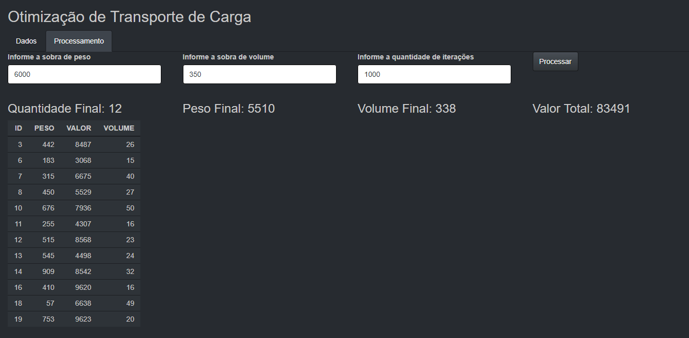

# Aplicação para Otimizar o Lucro no Transporte de Cargas

### Olá!!! 👋
 
Essa aplicação desenvolvida em R e Shiny é uma solução para maximizar o uso dos espaços vazios da área de carga de um avião. Informando o peso e o volume ainda livres, a aplicação analisa a lista dos itens que ainda precisam ser embarcados e monta a composição mais rentável financeiramente para ocupar esse espaço, sem exceder os limites. 

 

## 🛠️ Tecnologias utilizadas
 

* [R](https://www.r-project.org/)
  Utilizado o algoritmo <a href="https://www.rdocumentation.org/packages/GA/versions/3.2.1/topics/ga" rel="nofollow">ga: Genetic Algorithms</a>.
* [Shiny](https://shiny.rstudio.com/)

 
## 📌 Visualização
 
 

 

