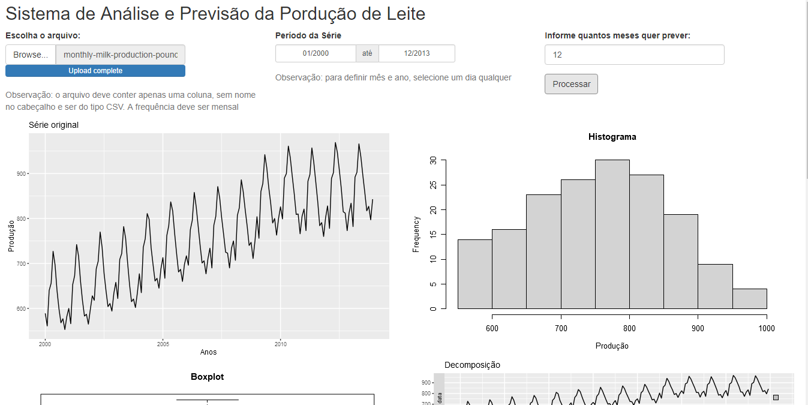

# Analisando e Prevendo a Produção de Leite
### Olá!!! 👋

Essa aplicação foi desenvolvida para atender a necessidade do cliente em vizualizar a situação atual da produção de leite da sua fazenda e apresentar um prognóstico para os próximos meses.
 A aplicação apresenta uma análise do histórico de produção de leite. E a partir desses dados é feita a previsão da produção para até 12 meses. Foi utilizada a técnica Arima na previsão. 
 
 
## 🛠️ Tecnologias utilizadas
 

* [R](https://www.r-project.org/)
* [Shiny](https://shiny.rstudio.com/)

 
## 🚀 Acessar e usar a aplicação
 
 

### https://elvismaster.shinyapps.io/leite/
 

