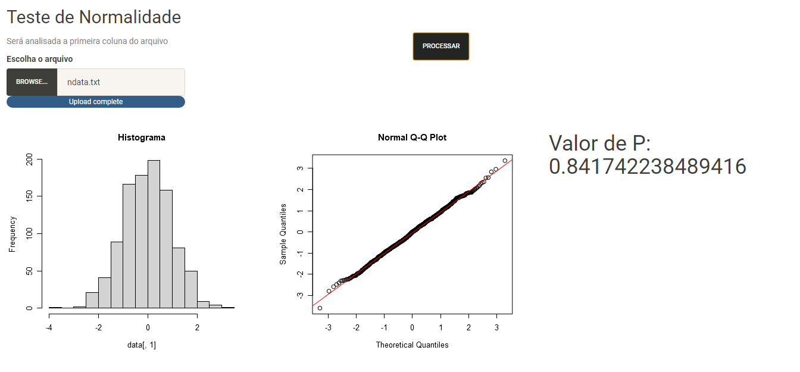
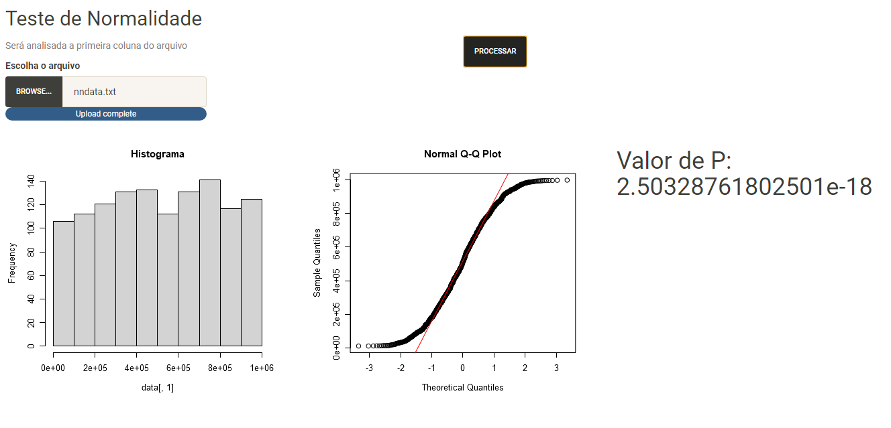

# Aplicação Web para Avaliar a Normalidade de Dados
### Olá!!! 👋

Essa aplicação foi desenvolvida para atender a necessidade do cliente de identificar em uma base de dados se os dados estão normalmente distribuídos.  
A aplicação recebe um upload de dados e apresenta 3 resultados de testes que possibilitam avaliar se os dados carregados estão Normalmente Distribuídos. 
 

## 🛠️ Tecnologias utilizadas
 

* [R](https://www.r-project.org/)
* [Shiny](https://shiny.rstudio.com/)

 
## 📌 Visualização
 
 

 
