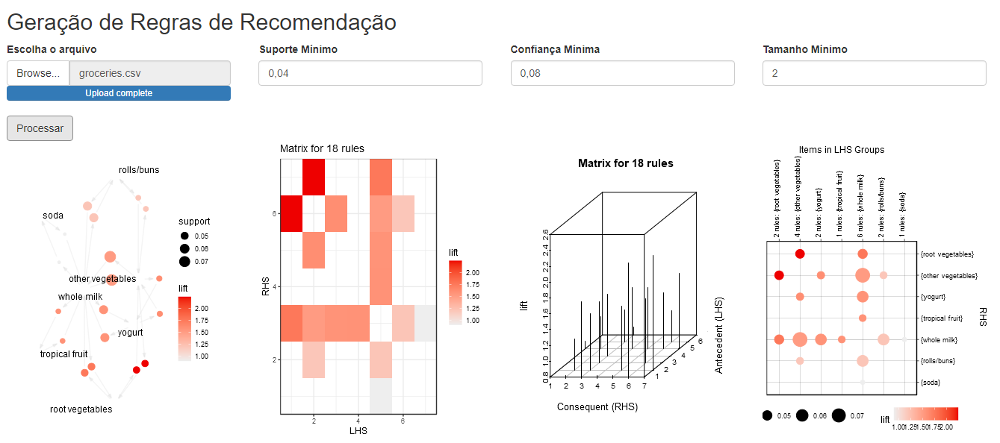
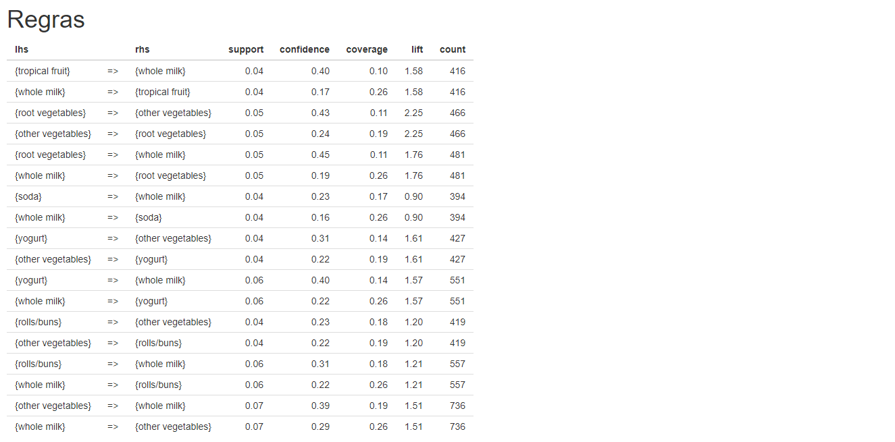

# Sistema de Geração e Avaliação de Regras de Recomendação para Mercearia de Comércio eletrônico e físico

### Olá!!! 👋

Uma mercearia possui comércio eletrônico e um loja física. No comércio eletrônico há o sistema de recomendação e o cliente não consegue ter acesso as regras para usar em estratégias na loja física.  
Essa aplicação então, foi desenvolvida para minerar uma base de dados lista de compras e produzir as próprias regras de recomendação para a loja física. A base de dados o próprio cliente consegue extrair do seu sistema usado na loja física.

 

## 🛠️ Tecnologias utilizadas
 

* [R](https://www.r-project.org/)
  Utilizado o algoritmo <a href="https://www.rdocumentation.org/packages/arules/versions/1.6-6/topics/apriori" rel="nofollow">apriori</a> para mineirar de regras de associação.
* [Shiny](https://shiny.rstudio.com/)

 
## 📌 Visualização
 
 

 

