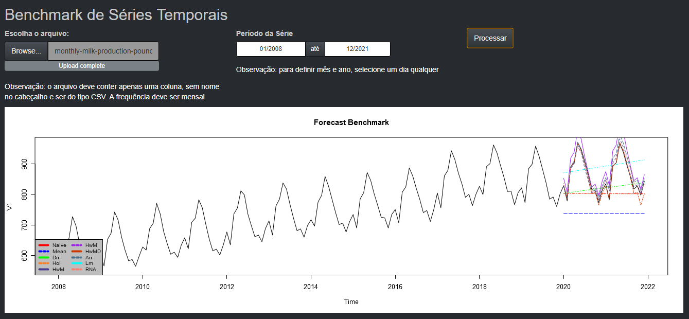
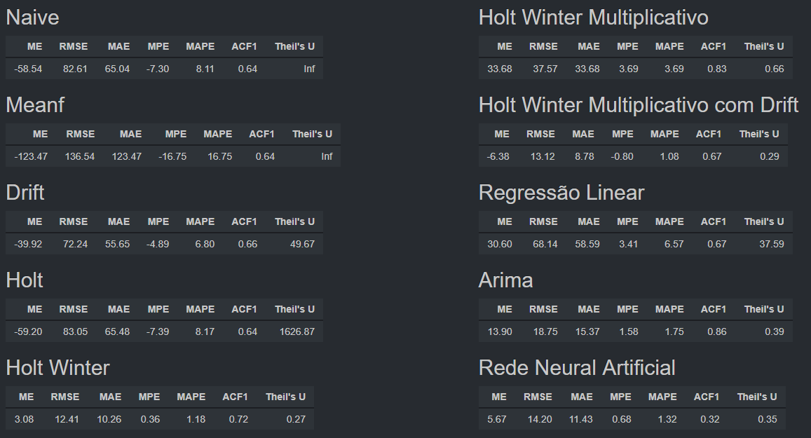

# Benchmark em Algorítimos de Forecast de Séries Temporais

### Olá!!! 👋

Essa aplicação desenvolvida em R e Shiny prevê a produção de leite de uma fazenda. A aplicação apresenta 10 resultados de previsão, onde cada um é gerado por um método de previsão diferente.  
Os resultados são apresentados através de um gráfico e há também uma tabela de acurácia para avaliar e comparar os resultados dos métodos.  

 

## 🛠️ Tecnologias utilizadas
 

* [Shiny](https://shiny.rstudio.com/)
* [R](https://www.r-project.org/)
 

### Metodos de Forecast:
* Naive
* Mean
* Drift
* Holt
* Holt Winter Aditivo
* Holt Winter Multiplicativo
* Holt Winter Multiplicativo Amortecido
* Regressão Linear
* Arima
* Rede Neural Artificial

 
## 📌 Visualização
 
 

 

