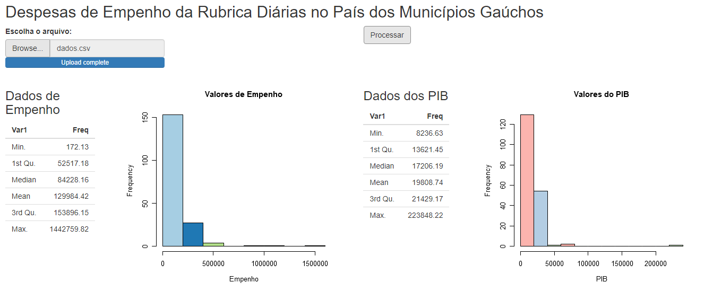
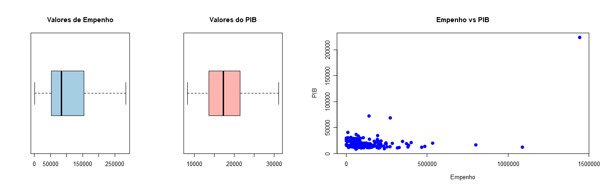
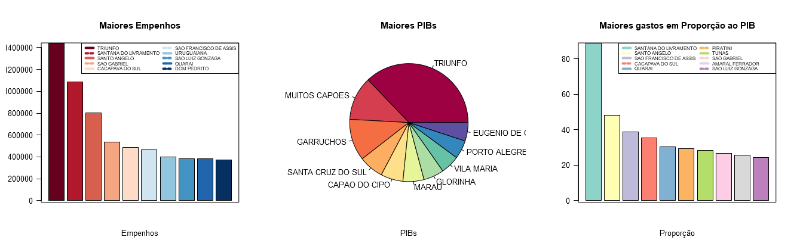

# Aplicação para Analisar Dados Públicos

### Olá!!! 👋

Essa aplicação desenvolvida em R e Shiny foi desenvolvida para analisar dados públicos de empenho em diárias no País e comparar com o PIB. Foram utilizados métodos de Análise de Dados Exploratória e os dados usados no exemplo são de municípios do Rio Grande do Sul (fonte dos dados: http://www.sefaz.rs.gov.br e http://www.dados.tce.rs.go.br). 
  

 

## 🛠️ Tecnologias utilizadas
 

* [Shiny](https://shiny.rstudio.com/)
* [R](https://www.r-project.org/)
 

### Funções utilizadas:
* summary()
* hist()
* plot()
* boxplot()
* barplot()

 
## 📌 Visualização
 
 

 

 

